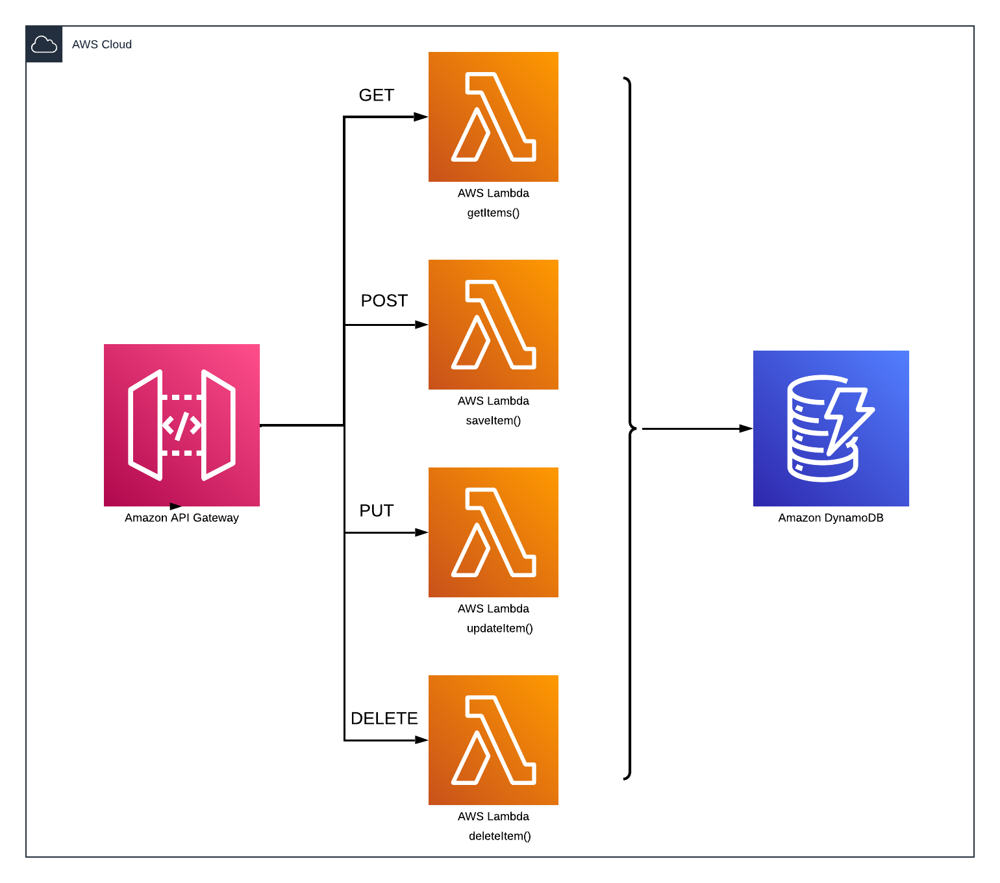

# AWS SAM APP CRUD



Este proyecto contiene el código para crear una aplicación serverless para poder desplegar la infraestructura en AWS con el framework SAM (Serverless Application Model). Incluye los siguientes archivos:

- functions/handelr.js  - Incluye las funciones necesarias para el CRUD (Create, Read, Update, Delete).
- template.yaml - A template that defines the application's AWS resources.

## Requerimientos para desplegar la aplicación en AWS
* SAM CLI - [Install the SAM CLI](https://docs.aws.amazon.com/serverless-application-model/latest/developerguide/serverless-sam-cli-install.html)
* Node.js - [Instalar Node.js](https://nodejs.org/es/)

## Recursos desplegados en AWS

Esta aplicación usar diferentes servicios de AWS para con seguir desplegar una API REST.

## API Gateway (Endpoints)
```yaml
      ApiGatewayApi:
        Type: AWS::Serverless::Api
        Properties:
          StageName: prod
          Cors:
            AllowMethods: "'POST, GET, PUT, DELETE, OPTIONS'"
            AllowHeaders: "'Content-Type'"
            AllowOrigin: "'*'"
```

## Funciones Lambda (Backend)
```yaml
      SaveItemFunction:
        Type: 'AWS::Serverless::Function'
        Properties:
          Handler: handler.saveItem
          Runtime: nodejs16.x
          CodeUri: ./functions
          Description: Function to store task in the DynamoDB table.
          Policies:
            - DynamoDBCrudPolicy:
                TableName: !Ref DynamoDBTable
          Environment:
            Variables:
              TABLE_DYNAMODB: !Ref DynamoDBTable
```
## Eventos

Los eventos que se usan para ejecutar las funciones Lambda se asocian a la API Gateway a los diferentes métodos.

```yaml
      Events:
        Api:
          Type: Api
          Properties: 
            Path: /tasks
            Method: POST
            RestApiId: 
              !Ref ApiGatewayApi
```

## Políticas (IAM)

Las políticas necesarias para poder acceder a los datos en DynamoDB desde las funciones Lambda.

```yaml
      Policies:
        - DynamoDBCrudPolicy:
            TableName: !Ref DynamoDBTable
```

## DynamoDB (Base de datos)
```yaml
      DynamoDBTable:
        Type: AWS::Serverless::SimpleTable
```

## Despliegue

Para desplegar la aplicación en AWS, se debe de ejecutar lo siguiente:

```bash
sam build
sam deploy --guided
```
